## Artpay

### Login
The first to use Artpay is to login with NEAR wallet.
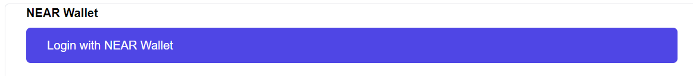

### Create new escrow
A client can create a job or escrow payment by listing the requirements and description of the job. They will also be locking in the funds (in NEAR) that will be paid to the artist (contractor) that has been choosen.
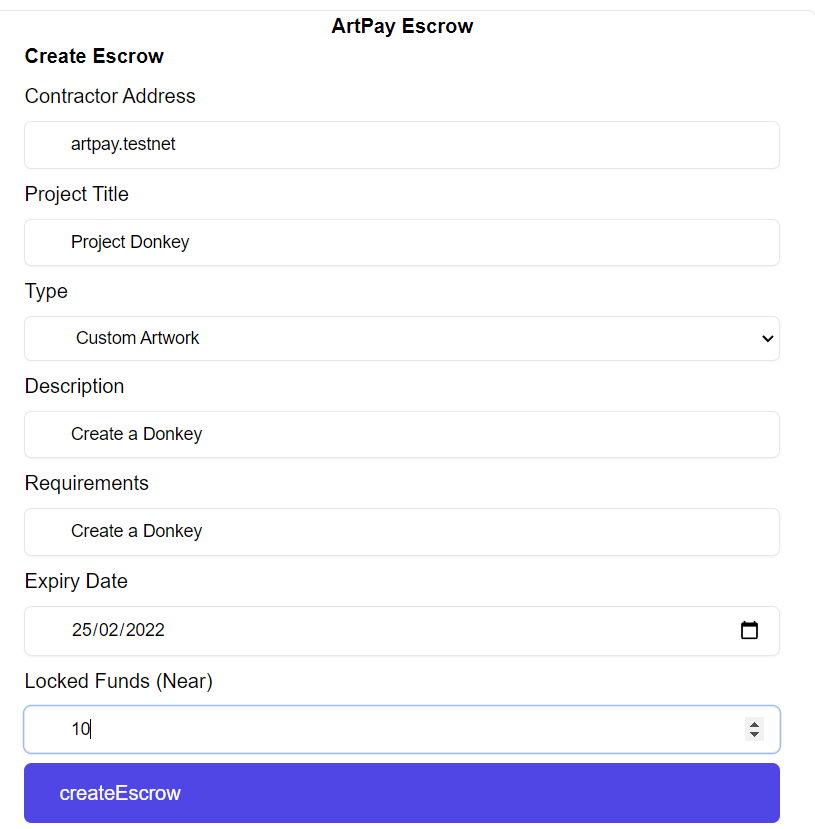

### View created escrow
you can view create escrow by using our view escrow. If you are a contractor, you'll need the contractor and the escrow id. In this case,
we (a client), created an escrow to to artpay.testnet (the contractor) and that return the id of 4. Hence the inputs here is as followed,
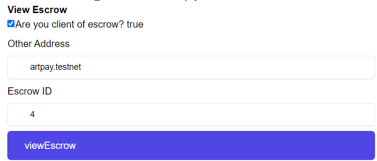
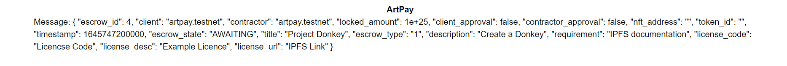

### ArtPay NFT
A contractor (or client) can interact with our NFT contract to meet the requirements of a create escrow, ArtPay utilises copyright and licensing that is stamped on the to be NFT (as metadata). Note users will have to provided those statement to ensure creation of NFT.

### Minting NFT
Users can mint an NFT with royalty and copyright statement
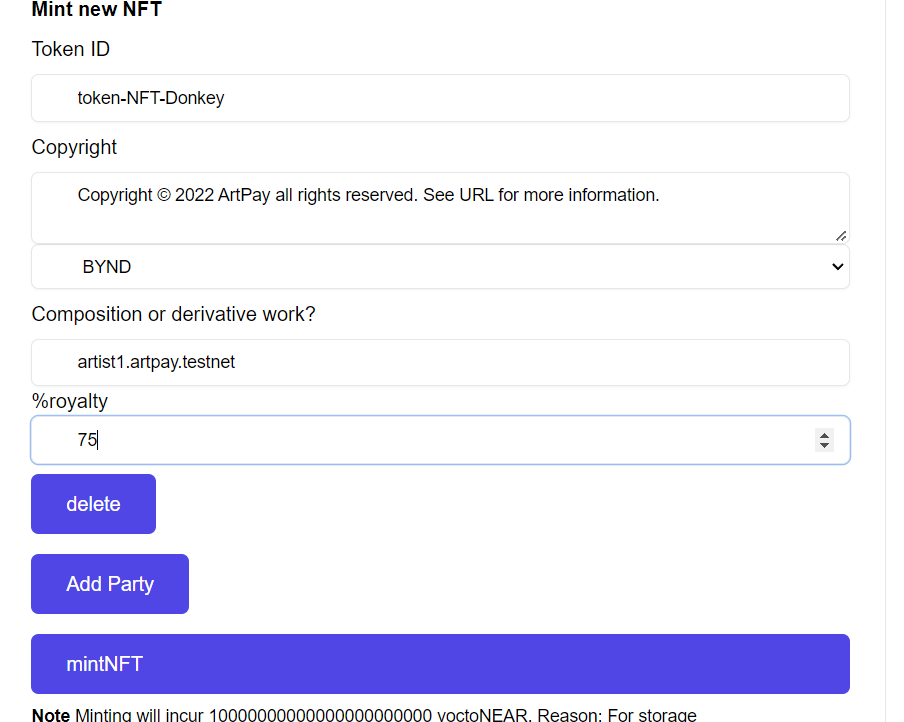

### Viewing NFT
The newly created NFT can be viewed by search for its `token-id`
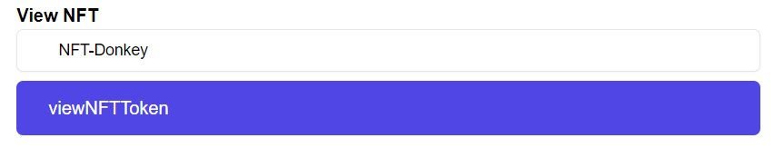
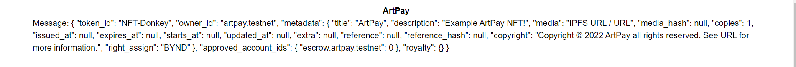

### Set Deliverable to Escrow
Since we have our NFT create for the escrow, the **contractor** can now set there deliverable for approval.
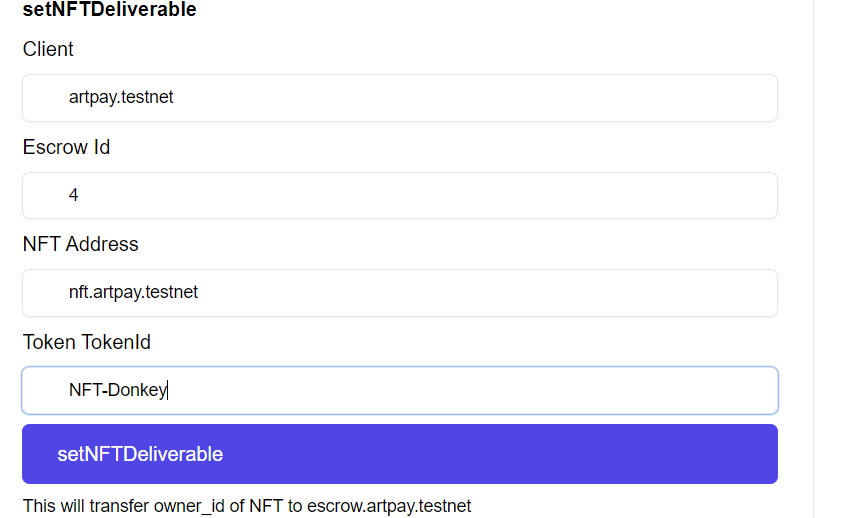

If you view the escrow again, the escrow should be in the approve state with the NFT locked in.
Viewing the NFT token, escrow.artpay.testnet should have ownership.

### Approval
In order for the escrow to be complete, both the client and contractor need to approve the requirements and deliverables.

If your the client of the escrow, you can approve as the client
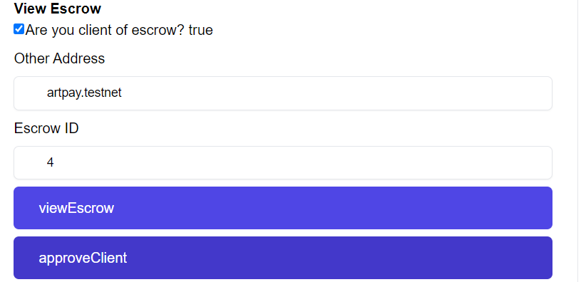

If your the client of the escrow, you can approve as the contractor

Viewing the escrow, the attribute of `client_approval` and `contractor_approval` should be true.

### Release
Until both approves are confirmed, only then can either party release the escrows, releasing the NEAR funds to the contractor and NFT ownership to the client. The escrow with be marked as complete and not further process can be done on the escrow.
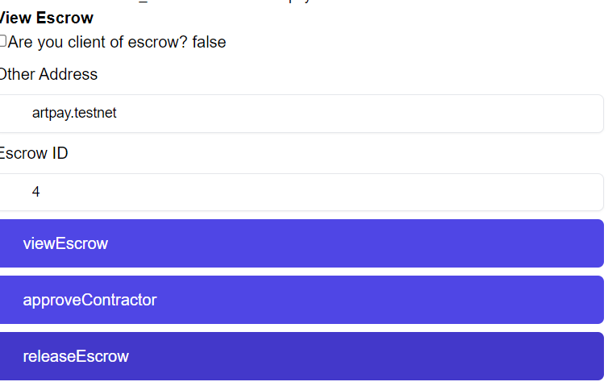

Viewing the escrow, the escrow should be in the final state known as Complete, with the locked funds being zero to avoid double spending.
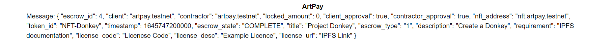

### Wallet
Within your wallet you will be able to **logout**, and **donate**